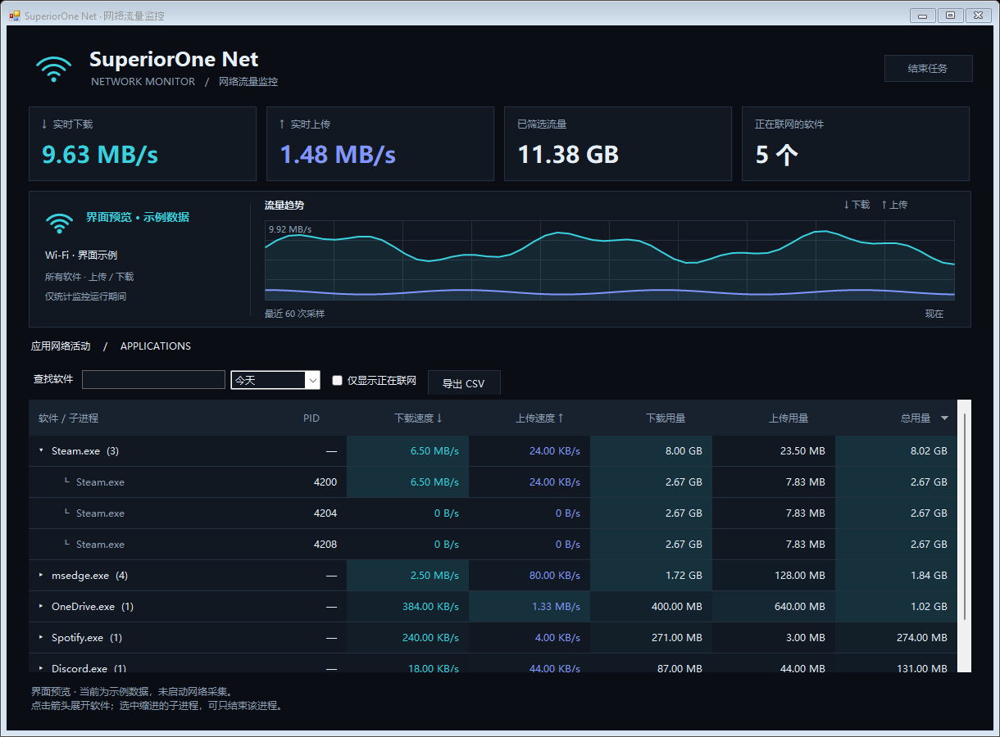

# SuperiorOne Net

中文 Windows 网络流量监控，面向 Windows 10/11 x64，使用系统自带 .NET Framework 4.x，无需安装 Python、Node 或抓包驱动。

## 使用

双击 `dist/SuperiorOneNet.exe`，允许管理员权限。界面每秒更新各软件的上传与下载速度、所选日期的上传/下载累计量。支持今天、本月、全部记录、指定日期、软件名／路径／PID 搜索、仅显示当前有流量的软件以及 CSV 导出。点击表头按数值排序；悬停软件名称查看路径。

同一可执行文件路径下的进程组成一个软件分组。点击软件左侧箭头（或双击名称、按键盘左右键）展开／收起。展开后，正在运行的各个进程向右缩进，分别显示 PID、实时上传下载和所选日期用量，包括暂时没有流量的进程。排序保留软件与子行的层级关系。这是按可执行文件分组，不是 Windows 的完整父子进程树；不同路径的辅助程序会单独列组。

界面采用黑灰色网络监控面板，配有 Wi-Fi 标识、青色下载／紫蓝色上传指示、实时指标和最近 60 次采样的流量曲线。网卡名称来自系统，监控覆盖各软件的网络活动，并不限于 Wi-Fi。真实流量为空时显示等待状态。

选中缩进的子进程后，右上角显示「结束进程」，确认后只结束该 PID 对应的进程，不会批量结束同组其他进程。选中软件汇总行时，按钮显示「结束整组」。执行前会校验路径和启动时间，防止 PID 被复用时选错目标；确认期间保留原进程句柄。未保存的内容可能丢失，部分软件会自动重启子进程，结束关键组件也可能导致该软件退出。已退出、受保护或无法确认身份的进程不会被结束。程序自身和系统关键进程受保护。历史记录保留，流量监控继续运行。刷新和排序保持选中进程的身份；目标退出或 PID 被复用时清除选择。

最小化窗口后在系统托盘继续监控，双击托盘恢复。关闭窗口或点击托盘的退出菜单会停止采集并保存。不自动设置开机启动。

数据每 10 秒及正常退出时保存到 `%LOCALAPPDATA%\SuperiorOneNet\usage.json`，保留上一版 `.bak`。意外退出可能损失最近 10 秒左右的记录。数据仅保存在本地，不上传，不读取网络内容。

## 统计口径

- 使用 Windows ETW 内核 TCP/IP 和 UDP 发送/接收事件，支持 IPv4 / IPv6，按事件中的 PID 和字节数统计。
- 包含局域网和回环通信，不是运营商账单用量。VPN、虚拟网卡、协议开销等可能造成差异；不另外累计 TCP 重传事件。
- 只统计本程序运行期间，不能恢复安装前或关闭时的流量。速度始终是实时速度，日期筛选只作用于累计用量。
- 子进程明细从新版开始记录，按 PID 和启动时间区分进程实例。旧版记录保留在软件汇总中，不能追溯拆分到 PID。汇总也包含已退出进程的用量，因此当前展开的子行合计可能低于软件总量。CSV 导出软件汇总，避免将父行与子行重复累计。运行中进程列表约每 3 秒刷新。
- 权限受限或已退出的短命进程可能仅显示进程名或 PID。进程信息最多缓存 2 秒，极短时间的 PID 重用可能影响归属。
- ETW 会批量交付事件，速度可能有短暂波动。高负载下事件丢失会在界面提示。
- 这是监控工具，不提供限速、断网或防火墙功能。

## 构建与验证

子进程版已通过编译和自测：单个测试进程终止、同组其他进程继续运行、PID 复用保护、选择保持、分进程流量及其保存恢复。

深色界面已通过编译并检查普通尺寸和最小尺寸的渲染预览。预览中的流量为示例数据。

`dist\SuperiorOneNet.exe --preview <绝对路径 PNG 文件>` 生成普通尺寸和最小尺寸的界面预览，使用明确标记的示例数据，不启动网络采集、不结束任何进程。正常启动始终显示真实监控数据。

运行 `powershell -ExecutionPolicy Bypass -File .\build.ps1`，使用 Windows 自带的 64 位 .NET Framework C# 编译器生成 exe。

旧版仍在运行时，可使用 `powershell -ExecutionPolicy Bypass -File .\build.ps1 -OutputDirectory .\dist-update` 生成独立新版。退出旧版后，再启动 `dist-update\SuperiorOneNet.exe`。

`dist\SuperiorOneNet.exe --self-test <绝对路径报告文件>` 检查记账、持久化、界面层级和选择保持，并创建两个专用测试进程以验证单进程结束与同组进程存活，最后清理测试进程。无需管理员权限，不操作正在使用的软件。

`dist\SuperiorOneNet.exe --capture-test <绝对路径报告文件>` 需要管理员权限，用真实本机 TCP、UDP IPv4/IPv6 及向 1.1.1.1 查询 example.com 的 DNS 请求检查 ETW 的进程归属和上传下载计数。测试使用程序同名互斥锁，请先退出界面。ETW 交付延迟可能超过固定测试等待时间，需结合报告判断。

原生 ETW ABI 固定为 x64，请勿编译为 x86。参考：[Windows 系统追踪会话](https://learn.microsoft.com/en-us/windows/win32/etw/configuring-and-starting-a-systemtraceprovider-session)、[TCP 发送事件](https://learn.microsoft.com/en-us/windows/win32/etw/tcpip-sendipv4)、[ETW 消费接口](https://learn.microsoft.com/en-us/windows/win32/api/evntrace/ns-evntrace-event_trace_logfilew)。
